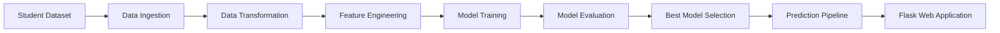
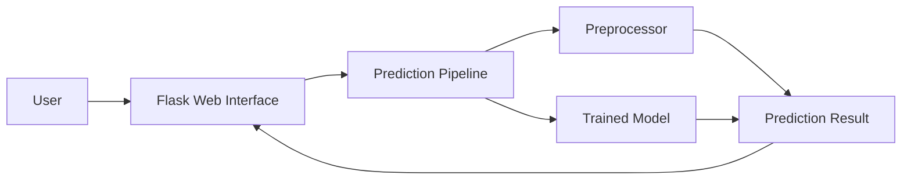

# Student Performance Prediction System


An end-to-end Machine Learning project that predicts a student's Mathematics score based on demographic and academic information. The project demonstrates the complete machine learning workflow from data ingestion and preprocessing to model training, evaluation, and deployment using Flask.

---

## Project Overview

The objective of this project is to predict a student's Mathematics score using the following features:

- Gender
- Race / Ethnicity
- Parental Level of Education
- Lunch Type
- Test Preparation Course
- Reading Score
- Writing Score

The application accepts these inputs through a web interface and generates a Mathematics score prediction using a trained machine learning model.

---

## Problem Statement

Student academic performance is influenced by multiple social and educational factors. By analyzing historical student data, machine learning models can identify patterns and estimate future performance.

This project demonstrates how machine learning can be used to predict Mathematics scores from available student information.

---

## Dataset Description

The dataset contains student demographic and examination-related information.

| Feature | Description |
|----------|-------------|
| Gender | Male / Female |
| Race/Ethnicity | Group A - E |
| Parental Education | Education level of parents |
| Lunch Type | Standard or Free/Reduced |
| Test Preparation Course | Completed or None |
| Reading Score | Reading exam score |
| Writing Score | Writing exam score |
| Math Score | Target Variable |

---

## Technology Stack

| Category | Tools Used |
|-----------|------------|
| Programming Language | Python |
| Machine Learning | Scikit-Learn |
| Data Processing | Pandas, NumPy |
| Model Deployment | Flask |
| Frontend | HTML, CSS |
| Serialization | Pickle |

---

## Project Architecture



---

## Machine Learning Workflow

### Data Ingestion
- Read dataset
- Split data into train and test sets
- Store processed files in artifacts folder

### Data Transformation
- Handle categorical features
- Apply One-Hot Encoding
- Apply Standard Scaling
- Build preprocessing pipeline

### Model Training
The following machine learning models were trained and evaluated:

- Linear Regression
- Decision Tree Regressor
- Random Forest Regressor
- Gradient Boosting Regressor
- XGBoost Regressor
- CatBoost Regressor
- AdaBoost Regressor

### Model Evaluation
Models were compared using the R² Score metric and the best-performing model was selected for deployment.

---

## Model Performance

| Model | R² Score |
|---------|---------|
| Ridge Regression | 0.8806 |
| Linear Regression | 0.8803 |
| CatBoost Regressor | 0.8516 |
| AdaBoost Regressor | 0.8498 |
| Random Forest Regressor | 0.8473 |
| Lasso Regression | 0.8253 |
| XGBoost Regressor | 0.8216 |
| KNN Regressor | 0.7838 |
| Decision Tree Regressor | 0.7603 |

### Best Model

- **Model:** Ridge Regression
- **R² Score:** 0.88

---

## Project Structure

```text
StudentPerformanceIndicator/
│
├── artifacts/
│   ├── model.pkl
│   ├── preprocessor.pkl
│   ├── train.csv
│   ├── test.csv
│
├── notebook/
│   ├── data/
│   └── EDA and Model Training.ipynb
│
├── src/
│   ├── components/
│   │   ├── data_ingestion.py
│   │   ├── data_transformation.py
│   │   └── model_trainer.py
│   │
│   ├── pipeline/
│   │   └── predict_pipeline.py
│   │
│   ├── exception.py
│   ├── logger.py
│   └── utils.py
│
├── templates/
│   ├── index.html
│   └── home.html
│
├── app.py
├── requirements.txt
└── README.md
```

---

## Deployment Architecture



---

## Installation

### Clone Repository

```bash
git clone https://github.com/gojo2005/StudentPerformanceIndicator.git
cd StudentPerformanceIndicator
```

### Create Virtual Environment

```bash
conda create -n mlproject python=3.12
conda activate mlproject
```

### Install Dependencies

```bash
pip install -r requirements.txt
```

---

## Running the Application

```bash
python app.py
```

Open your browser and visit:

```text
http://localhost:5000
```

---

## Key Learnings

Through this project, I learned:

- Building modular machine learning pipelines
- Data preprocessing using Scikit-Learn
- Feature engineering techniques
- Model comparison and evaluation
- Flask-based deployment
- Project structuring for production-style ML workflows
- Git and GitHub version control

---

## Future Improvements

- Deploy application on Render or Railway
- Add user authentication
- Add model monitoring
- Store predictions in a database
- Containerize using Docker
- Integrate CI/CD pipeline

---

## Author

**Prithviraj Mukhiya**

B.Tech, Electronics and Communication Engineering  
Indian Institute of Information Technology Kota (IIIT Kota)

GitHub: https://github.com/gojo2005

Project Repository:  
https://github.com/gojo2005/StudentPerformanceIndicator

---

If you found this project useful, feel free to star the repository.